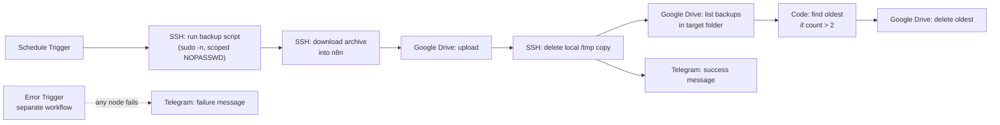

# OpenClaw → Google Drive Backup

A small, self-hosted backup pipeline for a personal [OpenClaw](https://github.com/openclaw/openclaw)
server: an [n8n](https://n8n.io) workflow pulls a compressed backup off the
server over SSH, uploads it to Google Drive, keeps only the two most recent
copies, cleans up after itself, and reports success or failure to Telegram.

No third-party backup SaaS, no long-term storage of large binaries in n8n
itself — just a scheduled workflow, a scoped SSH credential, and Drive as
the destination.

## Why

OpenClaw's data directory (`/root/.openclaw`) holds everything the agent
knows and can do — losing it isn't a "reinstall and move on" situation.
This repo is the backup side of that: automated, retained, and monitored,
without needing a dedicated backup server or paid service.

## Architecture



The retention branch (F → H → I) and the success notification (G) run in
parallel off the same node, so the Telegram message always fires once the
backup is safely uploaded — regardless of whether a retention delete
happens that run.

Failure handling is a **separate** n8n workflow using an `Error Trigger`
node, linked via the main workflow's *Settings → Error Workflow*. This
catches a failure at any node — SSH drops, Drive quota, auth expiry —
without needing per-node error branches.

## What's in this repo

```
openclaw-backup/
├── README.md
├── LICENSE
├── scripts/
│   ├── openclaw-backup.sh              # runs on the OpenClaw server
│   └── openclaw-backup.sudoers.example # scoped NOPASSWD rule
└── n8n/
    └── README.md                       # how to export/place your workflow JSON
```

The n8n workflow itself isn't checked in as a ready-made JSON — see
[`n8n/README.md`](n8n/README.md) for why, and for the full node-by-node
structure to rebuild or export it.

## Prerequisites

- A self-hosted n8n instance with SSH and Google Drive credentials configured
- SSH access to the OpenClaw server from n8n's host
- A Google Cloud OAuth client (Drive API enabled) for the Google Drive node
- A Telegram bot (via [@BotFather](https://t.me/BotFather)) for notifications

## Setup

1. **Copy the script to the OpenClaw server:**
   ```bash
   scp scripts/openclaw-backup.sh root@your-server:/usr/local/bin/
   ssh root@your-server chmod +x /usr/local/bin/openclaw-backup.sh
   ```

2. **Scope sudo access** for the automation user n8n connects as — see
   [`scripts/openclaw-backup.sudoers.example`](scripts/openclaw-backup.sudoers.example).
   This limits a leaked SSH key to running *only* this script as root, not
   arbitrary commands.

3. **Build the n8n workflow** following the node table in
   [`n8n/README.md`](n8n/README.md), or import your own export once you have one.

4. **Set retention and schedule** in the Schedule Trigger and the Code node
   (`files.length > 2` controls how many backups are kept — change the `2`
   to whatever you want).

5. **Configure the error workflow** and link it under the main workflow's
   Settings so failures anywhere in the chain reach Telegram.

## Operational notes

- **n8n's own disk usage**: the backup archive passes *through* n8n as
  binary data before landing in Drive. Set the workflow's **"Save
  successful production executions"** setting to **None** (Workflow →
  Settings) so n8n doesn't also retain a full copy of every successful
  run's binary data — errors still get saved for debugging.
- **Reverse proxy / Zero Trust**: if your n8n instance sits behind
  Cloudflare Access (or similar), make sure your OAuth callback path
  (`/rest/oauth2-credential/callback`) has a bypass policy — otherwise the
  Google OAuth flow gets intercepted by the login wall instead of reaching
  n8n.
- **Timezone**: set the workflow's timezone explicitly rather than leaving
  it on the instance default, so the schedule runs when you actually expect.

## License

MIT — see [LICENSE](LICENSE).

## Author

**Mustafa Utku Seyithanoğlu**

- Personal: [mutk.us](https://mutk.us)
- Blog: [mutkus.com](https://mutkus.com)
